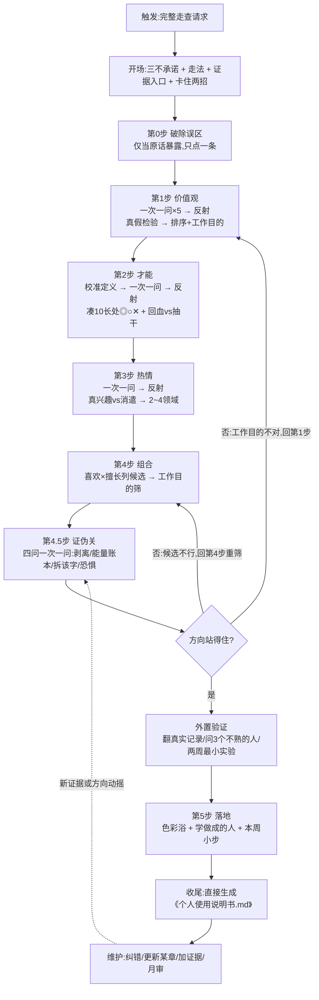

# 个人使用说明书 · skill

> 帮我读懂自己,并找到第一个"先去做做看"的方向。
> 纯 Markdown,零依赖,不需要 Node/JSON/任何运算。

## 这是什么

基于八木仁平《如何找到想做的事》的"自我认知法"(喜欢 × 擅长 × 重要),通过多轮教练对话,带你理清 **价值观 → 才能 → 热情**,组合出"真正想做的事",过一道**证伪关**后,生成一份你能自己维护的《个人使用说明书.md》。

## 它不做什么(说在前面,免得误会)

- **不做测评、不给你匹配职业**,不承诺唯一正确答案。
- **不替你下结论**。它给的是镜子和方法,方向由你验证、由你改。
- 找到的"方向"是**待验证的假设**,不是判决。

## 适合谁

> **如果你想要"快速"出一份使用说明书——这份 skill 不适合你。**它需要你静下心来,花一点时间(完整走一遍通常 30 分钟以上,可分多次进行),做一次真正属于自己的梳理。它不做测评、不给你现成结论,给的是镜子和方法。

- 不知道想做什么、有点迷茫的人
- 想知道自己擅长什么、什么会给自己充电的人
- 想把自己"用明白"、并拿到一份可随身带的说明书的人

## 安装

把整个 `个人使用说明书` 文件夹放进你助手的技能目录。

- **workbuddy**:已于 2026-09-05 实测——触发加载与开场正常(直接进第 1 步,不再弹菜单);约 30 分钟跑通主流程,节奏与设计稿一致、无明显卡顿。收尾生成与长期维护环节,建议正式使用前再完整走一遍核验。
- **Codex**:按 Codex 技能标准编写,放入 `~/.agents/skills/` 或对应技能目录即可使用;尚未在 Codex 宿主上实测加载与触发,装完请先实测一次(输入触发语,看是否加载、是否按指示读取 references/)。
- **其他宿主(Claude Code 等)**:按各宿主规则放入技能目录后,**先做一次触发实测**。不同宿主对"技能名/frontmatter/文件夹命名"的规则有差异,本说明不替它们打包票。
- 部分宿主不会自动加载 `references/` 里的文件;若对话中没有用上问题库,请按 SKILL.md 的指示让它"先读取 references/questions.md"。

## 使用

对你的助手说:

- "用 个人使用说明书 带我走一遍"
- "我最近很迷茫,不知道想做什么"
- "帮我做一份我的使用说明书"
- 想只跑一部分:"只帮我看看这个方向该不该信"(证伪关) / "只补我说明书第 3 章"

## 流程(怎么走)

完整走查 = 一次只问一个问题的多轮对话,总时长通常 30 分钟以上,可分多次。下图是 Mermaid,**Obsidian 与 GitHub 都能直接渲染**:



**核心节奏**:抛一个主问题 → 用户答 → 反射(把他的碎片拼成关键词喂回确认)→ 再问下一个。
**局部使用**:默认走完整流程;只有你主动说"只跑证伪关 / 只补某章",才切入对应段落。

## 隐私(请先读,再决定贴什么)

- **重要**:本 skill 通过对话工作,**你贴进来的日记、备忘录、聊天记录等所有内容,会发送给你正在使用的 AI 服务商**(云端模型的话,还可能按该服务商的政策被留存/用于改进)。**别贴你不想让该服务商看到或留存的内容。**
- 在意隐私时,选项:①用支持本地模型的宿主和本地模型跑;②贴之前先自己脱敏(改人名/隐去细节);③只口述大意,不贴原文——对话也能走,证据只是加成。
- 产物《个人使用说明书.md》由你自己保存,想存哪存哪;本 skill 不会把产物自动上传到任何第三方平台。
- 手写笔记等敏感原件不必上传:证据库存"引用 + 一句话说明"即可,原文留在你自己手里。

## 文件结构

```
个人使用说明书/
├── LICENSE                   MIT 许可
├── README.md                 本说明
├── SKILL.md                  给助手的操作手册(入口)
└── references/
    ├── questions.md          三支柱完整问题库 + 证据引导(分级/提炼/存储)
    ├── keywords.md           价值观/才能/热情示例词
    ├── tools.md              5 误区 · 证伪关 · 外置验证 · 安全转介 · 出处表
    └── manual-template.md    说明书模板(虚构示例 + 空白版)
```

## 致谢与出处

> **本 skill 是第三方依据八木仁平《如何找到想做的事》一书方法整理的教练流程,非该书或其作者官方出品。**

- 方法:八木仁平《如何找到想做的事》;公式与顺序表述与该书一致,细节出处见 `references/tools.md` 末尾的"资料来源与引用状态"。
- 底层参考:[Georgellx/skills](https://github.com/Georgellx/skills) 的 `self-understanding-coach`(派生自该仓库,已核真实存在)。
- 机制参考:斯坦福人生设计课(模块化/护栏)、自己.skill(纠错与版本机制)。
- 本版增量:证伪关 + 外置验证、行为证据优先、安全转介线、说明书式交付、纯 md 零依赖。


